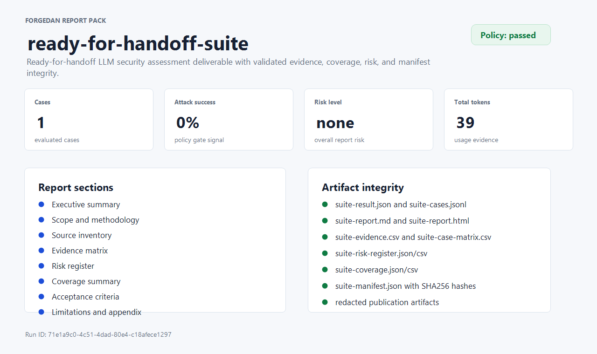
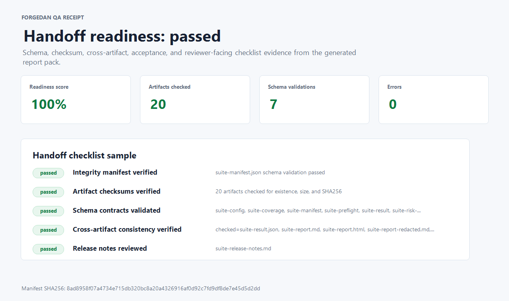
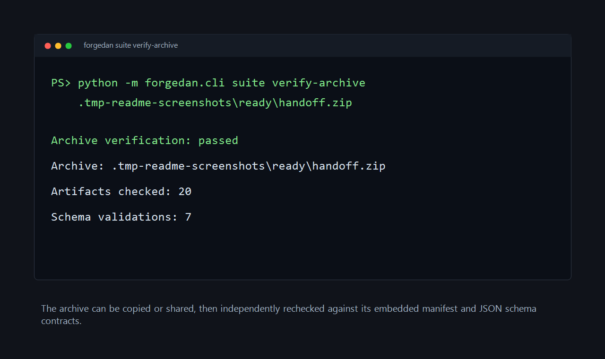

<div align="center">

# FORGEDAN

### Report-first LLM Security Assessment Framework
### 面向报告交付的 LLM 安全评估框架

[](https://www.python.org/downloads/)
[](https://github.com/Coff0xc/LLM-Security-Assessment-Framework/actions/workflows/ci.yml)
[](LICENSE)
[](https://arxiv.org/abs/2511.13548)
[](https://vuejs.org/)

**Reproducible suites | Evidence-rich report packs | QA receipts | Archive verification**

**可复现套件 | 证据化报告包 | QA 交接回执 | 归档校验**

[English](#english-complete-guide) · [中文](#中文完整说明) · [Standalone Chinese README](README.zh-CN.md)

English: [Overview](#overview) · [Screenshots](#screenshots) · [Quick Start](#quick-start) · [Report Workflow](#report-workflow) · [Report Pack Outputs](#report-pack-outputs) · [Development](#development)

中文：[项目定位](#项目定位) · [使用截图](#使用截图) · [快速开始](#快速开始-1) · [报告工作流](#报告工作流-1) · [报告包输出](#报告包输出) · [开发与验证](#开发与验证)

</div>

---

## README Format / README 格式

This README is maintained as two complete language tracks:

- **English Complete Guide** for GitHub visitors, reviewers, and automation users.
- **中文完整说明** for Chinese reviewers, report recipients, and internal handoff.

Both tracks cover the same project positioning, screenshots, installation,
smoke path, report workflow, artifacts, validation gates, API surface,
development commands, roadmap, safety notes, and license. The standalone
[README.zh-CN.md](README.zh-CN.md) remains available for Chinese-only sharing.

本 README 采用两条完整语言轨道维护：

- **English Complete Guide**：面向 GitHub 访客、英文评审人与自动化使用者。
- **中文完整说明**：面向中文评审人、报告接收方和内部交接。

两套内容覆盖同一组事实：项目定位、截图、安装、smoke path、报告工作流、制品清单、
验证门禁、API、开发命令、路线图、安全说明和许可证。独立中文版本仍保留在
[README.zh-CN.md](README.zh-CN.md)，便于单独转发。

## Report Delivery Snapshot / 报告交付速览

| Topic | English | 中文 |
| --- | --- | --- |
| Purpose | Generate reproducible LLM security assessment report packs. This is a report-delivery project, not a commercial security platform. | 生成可复现的 LLM 安全评估报告包。本项目目标是报告交付，不是商业化安全平台。 |
| Smoke path | `preflight` -> `suite run` -> `validate-report` -> `verify-bundle` -> `qa-report --strict-handoff` -> `archive` -> `verify-archive`. | 推荐路径：预检、生成报告包、校验 JSON 制品、验证目录包、生成严格 QA 回执、打包 ZIP、交付后复核归档。 |
| Evidence | Markdown/HTML reports, JSON/JSONL traces, CSV evidence, case matrix, coverage summary, risk register, release notes, QA receipt, manifest. | 证据包括 Markdown/HTML 报告、JSON/JSONL trace、CSV 证据矩阵、case matrix、覆盖率摘要、风险登记、发布说明、QA 回执和 manifest。 |
| Integrity | Schemas, SHA256/size checks, sidecar binding, redaction checks, cross-artifact consistency, archive verification. | 通过 Schema、SHA256/大小、sidecar 绑定、脱敏检查、跨制品一致性和 ZIP 归档校验保护交付质量。 |
| Sample | [Ready-for-handoff sample pack](docs/sample-report-pack/ready-for-handoff/README.md) includes a report, QA receipt, manifest, and verified archive. | [可交付样例包](docs/sample-report-pack/ready-for-handoff/README.md) 已包含报告、QA 回执、manifest 和已校验归档。 |

---

# English Complete Guide

## Overview

**FORGEDAN** is a report-oriented LLM security assessment framework based on the
paper [*FORGEDAN: An Evolutionary Framework for Jailbreaking Aligned Large
Language Models*](https://arxiv.org/abs/2511.13548).

The framework still includes evolutionary jailbreak attacks, model adapters,
WebScan utilities, a REST API, and a Vue dashboard. Its current project goal is
clearer and narrower: **produce auditable, reproducible, handoff-ready security
assessment reports**.

It helps assessment teams define YAML suites, run deterministic scanners and
scorers, collect evidence, generate narrative reports, validate JSON Schema
contracts, produce QA receipts, and package deliverables into archives that can
be verified after copying or sharing.

## Key Capabilities

| Area | Capabilities |
| --- | --- |
| Report suites | YAML suite definitions, inline or imported cases, replay caches, deterministic seeds, policy gates, preflight readiness checks |
| Report artifacts | Markdown/HTML reports, executive summaries, evidence CSVs, case matrices, risk registers, coverage summaries, release notes, public bundle indexes |
| Evidence integrity | JSON Schemas, artifact manifests, SHA256/size checks, cross-artifact consistency, redacted-publication leak checks |
| Handoff QA | QA receipt JSON/Markdown, acceptance criteria, reviewer decisions, owner/due-date tracking, strict handoff gates |
| Assessment coverage | Prompt injection, jailbreak roleplay, system prompt leakage, secrets/PII exposure, Agent/MCP/tool policy risk, model artifact and serialization signals |
| Baseline engine | FORGEDAN, AutoDAN, PAIR, GCG, Crescendo, TAP, model adapters, WebScan, CLI, REST API, Vue dashboard |

## GitHub About

Suggested repository description:

> Report-first LLM security assessment framework for reproducible red-team suites, evidence packs, QA receipts, schemas, and archive verification.

Suggested topics:

`llm-security`, `ai-red-team`, `prompt-injection`, `jailbreak`,
`owasp-llm`, `mcp-security`, `agent-security`, `security-reporting`,
`risk-register`, `audit-evidence`, `json-schema`, `pytest`, `python`

## Screenshots

These screenshots come from the checked-in sample generated by
`examples/ready-for-handoff-suite.yml`. The rendered sample is available at
[docs/sample-report-pack/ready-for-handoff](docs/sample-report-pack/ready-for-handoff/README.md).

### Report Pack Overview



### QA Receipt



### Archive Verification



## Quick Start

### Prerequisites

- Python >= 3.9
- Git
- Node.js >= 18, only required for the Vue dashboard

### Install

```bash
git clone https://github.com/Coff0xc/LLM-Security-Assessment-Framework.git
cd LLM-Security-Assessment-Framework

# Minimal backend install
pip install -e .

# Web dashboard and WebScan dependencies
pip install -e ".[web]"

# Full provider, web, monitoring, and dev extras
pip install -e ".[all]"

# Frontend
cd frontend
npm install
```

### Generate a Ready-for-Handoff Report Pack

```bash
python -m forgedan.cli suite preflight examples/ready-for-handoff-suite.yml --strict --output reports/preflight-ready
python -m forgedan.cli suite run examples/ready-for-handoff-suite.yml --output reports/suite-ready
python -m forgedan.cli suite validate-report reports/suite-ready/suite-result.json
python -m forgedan.cli suite verify-bundle reports/suite-ready/suite-manifest.json
python -m forgedan.cli suite qa-report reports/suite-ready/suite-manifest.json --output reports/suite-ready/qa --strict-handoff
python -m forgedan.cli suite archive reports/suite-ready/suite-manifest.json --output reports/suite-ready/handoff.zip
python -m forgedan.cli suite verify-archive reports/suite-ready/handoff.zip
```

The same commands can be run as `forgedan suite ...` after installing the
console script.

### Run a Zero-Config Attack Demo

```bash
python -m forgedan.cli run --quick -g "test prompt" -m mock:test
```

### Run the Web Dashboard

```bash
python -m forgedan.cli web
cd frontend
npm run dev
```

The backend defaults to `:5000`; the frontend defaults to `:5173`.

## Documentation

| Document | Purpose |
| --- | --- |
| [docs/sample-report-pack/ready-for-handoff/](docs/sample-report-pack/ready-for-handoff/README.md) | Checked-in mock report pack with QA receipt and verified ZIP archive |
| [docs/llm-security-landscape.md](docs/llm-security-landscape.md) | Competitor scan, gaps, and optimization priorities |
| [docs/lint-roadmap.md](docs/lint-roadmap.md) | Current CI lint gate, measured lint debt, and promotion plan |
| [docs/repository-about.md](docs/repository-about.md) | Repository sidebar wording and topic recommendations |
| [schemas/](schemas/) | JSON Schema contracts for report artifacts |
| [examples/](examples/) | Runnable suites, case fixtures, MCP manifests, model artifact fixtures |

## Attack Methods

| Method | Type | Description | Paper |
| --- | --- | --- | --- |
| FORGEDAN | Evolutionary | Multi-level mutation with semantic fitness and dual judge | [arXiv:2511.13548](https://arxiv.org/abs/2511.13548) |
| AutoDAN | Evolutionary | Hierarchical genetic algorithm for stealthy jailbreak prompts | [ICLR 2024](https://arxiv.org/abs/2310.04451) |
| PAIR | LLM-iterative | Black-box jailbreak via attacker-target LLM iteration | [NeurIPS 2024](https://arxiv.org/abs/2310.08419) |
| GCG | Gradient-free | Greedy coordinate adversarial suffix generation | [ICML 2023](https://arxiv.org/abs/2307.15043) |
| Crescendo | Multi-turn | Gradual escalation from benign to harmful content | [USENIX Security 2025](https://arxiv.org/abs/2404.01833) |
| TAP | Tree search | Tree-of-thought attack with pruning and multi-LLM collaboration | [NeurIPS 2024](https://arxiv.org/abs/2312.02119) |

## Model Adapters

| Provider | Models | Example |
| --- | --- | --- |
| OpenAI | GPT-3.5, GPT-4, GPT-4o | `openai:gpt-4` |
| Anthropic | Claude 3 Opus/Sonnet/Haiku | `anthropic:claude-3-opus` |
| Google | Gemini Pro, Gemini Vision | `gemini:gemini-pro` |
| DeepSeek | DeepSeek Chat/Coder | `deepseek:deepseek-chat` |
| Zhipu | GLM-4, GLM-3 | `zhipu:glm-4` |
| Qwen | Qwen Max/Plus | `qwen:qwen-max` |
| Moonshot | Kimi | `moonshot:moonshot-v1-8k` |
| Yi | Yi Large/Medium | `yi:yi-large` |
| Baichuan | Baichuan 4/3 | `baichuan:baichuan-4` |
| Ollama | Local Ollama models | `ollama:llama2` |
| vLLM | Local vLLM services | `vllm:model-name` |
| HuggingFace | HuggingFace models | `huggingface:model-name` |
| Mock | Local testing, no API key | `mock:test-model` |

## WebScan Modes

| Mode | Description | Use Case |
| --- | --- | --- |
| URL crawler | Async crawling plus title, form, link, and script extraction | Gather attack material from target websites |
| Security scanner | XSS, SQLi, directory traversal, security headers, HTTP methods | Traditional web vulnerability assessment |
| LLM interaction test | Indirect prompt injection via web content and evolutionary optimization | Test LLM safety when processing web content |

## Report Workflow

1. **Define scope** in a suite YAML file: cases, imported evidence sources,
   report metadata, policy gates, coverage requirements, acceptance criteria,
   reviewer decisions, and risk-register defaults.
2. **Run preflight** with `suite preflight` to catch missing metadata,
   unresolved scorers, weak handoff criteria, missing provenance, and incomplete
   deterministic replay settings before spending provider budget.
3. **Generate the report pack** with `suite run`; the run writes raw and
   redacted machine-readable artifacts, Markdown/HTML reports, CSV matrices,
   coverage, risk register, release notes, and a manifest.
4. **Validate locally** with `validate-report` and `verify-bundle`; these checks
   bind schemas, hashes, summary counts, redacted artifacts, Markdown/HTML
   sidecars, and cross-artifact identities back to the source result.
5. **Prepare handoff** with `qa-report --strict-handoff`; the receipt records
   checklist status, blockers, acceptance criteria, source inventory, schema
   checks, and reviewer-facing evidence.
6. **Archive and verify** with `archive` and `verify-archive`; generated release
   notes and bundle indexes carry these handoff commands, and `verify-bundle`
   checks that the guidance stays present.

## CLI Reference

| Scenario | Command |
| --- | --- |
| Run a suite | `python -m forgedan.cli suite run examples/smoke-suite.yml` |
| Use per-run output directories | `python -m forgedan.cli suite run examples/smoke-suite.yml --run-id-dir` |
| Run preflight | `python -m forgedan.cli suite preflight examples/ready-for-handoff-suite.yml --strict --output reports/preflight-ready` |
| Validate a report artifact | `python -m forgedan.cli suite validate-report reports/suite-ready/suite-result.json` |
| Verify a report directory bundle | `python -m forgedan.cli suite verify-bundle reports/suite-ready/suite-manifest.json` |
| Write a QA receipt | `python -m forgedan.cli suite qa-report reports/suite-ready/suite-manifest.json --output reports/suite-ready/qa --strict-handoff` |
| Create a handoff ZIP | `python -m forgedan.cli suite archive reports/suite-ready/suite-manifest.json --output reports/suite-ready/handoff.zip` |
| Verify a handoff ZIP | `python -m forgedan.cli suite verify-archive reports/suite-ready/handoff.zip` |
| Compare suite results | `python -m forgedan.cli suite compare base.json current.json --output comparison.json --fail-on-regression` |
| Export taxonomy | `python -m forgedan.cli suite taxonomy --json` |
| Export schema references | `python -m forgedan.cli suite schemas --json` |
| Run a quick attack demo | `python -m forgedan.cli run --quick -g "test prompt" -m mock:test` |
| Start the API/web backend | `python -m forgedan.cli web` |

## Report Pack Outputs

| Artifact | Audience | Purpose |
| --- | --- | --- |
| `suite-report.md` / `suite-report.html` | Authorized reviewers | Narrative report with scope, method, findings, coverage, risk, usage, and limitations |
| `suite-result.json` / `suite-cases.jsonl` | Assessment team | Raw machine-readable results and case traces for audit replay |
| `suite-evidence.csv` | Reviewers | Finding evidence with taxonomy, confidence, severity rationale, OWASP LLM mapping, and recommendations |
| `suite-case-matrix.csv` | Reviewers | Case-level result, risk, usage, scorer, metadata, and coverage matrix |
| `suite-risk-register.json` / `suite-risk-register.csv` | Remediation owners | Risk tracker with owner, status, due date, severity rationale, and evidence fingerprint |
| `suite-coverage.json` / `suite-coverage.csv` | Reviewers | Coverage by case category, policy domain, taxonomy category, and OWASP LLM category |
| `suite-config.json` | Assessment team | Normalized suite input snapshot for audit replay |
| `suite-preflight.json` / `suite-preflight.md` | Assessment team | Readiness audit before model execution |
| `suite-release-notes.md` | Reviewers | Short handoff notes with risk, acceptance, source inventory, reviewer decisions, artifact pointers, and archive commands |
| Redacted report/result/cases | External reviewers | Lower-sensitivity publication package with prompts, responses, and evidence redacted |
| `suite-manifest.json` | Assessment team | Artifact integrity manifest with size, SHA256, schema references, sensitivity, audience labels, and acceptance status |
| `suite-qa-receipt.json` / `suite-qa-receipt.md` | Assessment lead | Handoff receipt covering manifest, schemas, hashes, consistency checks, preflight, acceptance, risk owners, and limitations |
| `handoff.zip` | Report recipient | Single-file package that can be re-verified after copying or sharing |

## JSON Schema and Verification

Schemas live in [schemas/](schemas/) and cover:

- `suite-result.schema.json`
- `suite-config.schema.json`
- `suite-manifest.schema.json`
- `suite-comparison.schema.json`
- `suite-comparison-manifest.schema.json`
- `suite-qa-receipt.schema.json`
- `suite-preflight.schema.json`
- `suite-risk-register.schema.json`
- `suite-coverage.schema.json`
- `finding-taxonomy.schema.json`

`validate-report` checks more than JSON Schema. It also recalculates source
inventory, usage cost, risk register totals, coverage totals, comparison
regression counts, QA receipt readiness, manifest binding, and Markdown/HTML
sidecar summaries so edited reports cannot silently diverge from machine data.

## Architecture

```text
forgedan/
├── suite.py              # Suite runner, artifact writer, validators, QA receipt, archive verifier
├── scanners.py           # Deterministic prompt/response/tool/model-artifact scanners
├── scorers.py            # Reusable deterministic suite scorers
├── finding_taxonomy.py   # Stable finding IDs, categories, priorities, OWASP LLM mappings
├── attacks/              # Attack algorithms and registry
├── adapters/             # Hosted, local, Chinese, vision, vLLM, HuggingFace, and mock adapters
├── api/                  # Flask Blueprint REST API
├── webscan/              # Crawler, web scanner, LLM interaction tester
├── engine.py             # Evolutionary algorithm engine
├── mutator.py            # Mutation strategies and MAB selection
├── fitness.py            # Semantic similarity fitness evaluation
└── judge.py              # Dual-judge mechanism

schemas/                  # Report artifact JSON Schema contracts
examples/                 # Runnable suite examples and fixtures
docs/                     # Landscape scan, lint roadmap, sample report pack
tests/                    # Pytest coverage
frontend/                 # Vue 3 SPA dashboard
```

## API Endpoints

```text
POST   /api/attacks/run
GET    /api/attacks/{id}/status
GET    /api/attacks/{id}/result
POST   /api/attacks/{id}/stop

GET    /api/models/providers
POST   /api/models/test

POST   /api/webscan/crawl
POST   /api/webscan/scan
POST   /api/webscan/llm-test

POST   /api/reports/generate
GET    /api/reports/{id}
GET    /api/reports/{id}/download

GET    /api/datasets
POST   /api/datasets/upload

GET    /api/health
GET    /api/metrics
```

## Development

```bash
pip install -e ".[dev]"

# Full pytest suite used locally
python -m pytest -q -W error::DeprecationWarning -p no:cacheprovider --basetemp .tmp-test

# CI report-pack gates
python -m forgedan.cli suite run examples/ready-for-handoff-suite.yml --output reports/suite-ready
python -m forgedan.cli suite verify-bundle reports/suite-ready/suite-manifest.json
python -m forgedan.cli suite qa-report reports/suite-ready/suite-manifest.json --output reports/suite-ready/qa --strict-handoff
python -m forgedan.cli suite verify-archive reports/suite-ready/handoff.zip

# Selected flake8 gate
python -m flake8 forgedan/ --select=E9,F63,F7,F82,E722,F401,F841 --show-source --statistics

# Formatter gate
python -m black --check forgedan tests

# Frontend build
cd frontend
npm install
npm run build
```

## Roadmap

- [x] Evolutionary engine and mutation strategies
- [x] Six attack methods: FORGEDAN, AutoDAN, PAIR, GCG, Crescendo, TAP
- [x] Hosted, Chinese, local, vLLM, HuggingFace, vision, and mock adapters
- [x] YAML suite runner with imported cases, custom scorers, response cache, source inventory, and policy gates
- [x] Prompt injection, jailbreak framing, system prompt leakage, secrets/PII, Agent/MCP/tool policy risk, and model artifact scanning
- [x] Markdown/HTML reports, redacted publication packs, evidence matrices, case matrices, risk registers, coverage summaries, release notes, and bundle indexes
- [x] JSON Schema contracts, semantic validation, manifest verification, QA receipts, and archive verification
- [x] Checked-in ready-for-handoff sample report pack with screenshots
- [x] CI gates for tests, report-pack validation, strict QA handoff, archive verification, selected flake8, Black, and frontend build
- [ ] Add more real Agent/MCP manifest fixtures and calibrate default trust-score policy
- [ ] Add HarmBench/JailbreakBench examples only where they improve report evidence quality
- [ ] Expand model serialization analysis when the report scope needs deeper artifact review

## Citation

```bibtex
@article{cheng2025forgedan,
  title={FORGEDAN: An Evolutionary Framework for Jailbreaking Aligned Large Language Models},
  author={Cheng, Siyang and Liu, Gaotian and Mei, Rui and Wang, Yilin and Zhang, Kejia and Wei, Kaishuo and Yu, Yuqi and Wen, Weiping and Wu, Xiaojie and Liu, Junhua},
  journal={arXiv preprint arXiv:2511.13548},
  year={2025}
}
```

## Contributing

Contributions are welcome. Please keep report artifacts, schemas, tests, and
documentation aligned when changing report behavior. See
[CONTRIBUTING.md](CONTRIBUTING.md) for the general contribution flow.

## Security

Use this project only for authorized security testing, research reproduction,
and report delivery. Raw prompts, responses, traces, caches, and evidence may
contain sensitive data; handle them according to the assessment scope and
handoff rules.

## License

This project is released under the MIT License. See [LICENSE](LICENSE).

---

# 中文完整说明

## 项目定位

**FORGEDAN** 基于论文 [*FORGEDAN: An Evolutionary Framework for Jailbreaking
Aligned Large Language Models*](https://arxiv.org/abs/2511.13548)，但当前项目重点已经从单纯算法演示扩展为
**面向报告交付的 LLM 安全评估框架**。

项目仍保留进化式越狱攻击、模型适配器、WebScan、REST API 和 Vue 仪表盘。
但当前目标更明确：**生成可审计、可复现、可交接的安全评估报告**。

它帮助评估团队用 YAML 定义测试套件，运行确定性扫描器和评分器，收集证据，
生成叙事报告，校验 JSON Schema 合约，输出 QA 回执，并把交付物打包为复制或分享后仍可复核的 ZIP 归档。

这不是商业化安全平台，而是一个报告交付、审计复核和研究复现优先的工程项目。

## 核心能力

| 领域 | 能力 |
| --- | --- |
| 报告套件 | YAML suite、内联/导入用例、响应缓存、确定性种子、策略门禁、运行前预检 |
| 报告制品 | Markdown/HTML 报告、执行摘要、证据 CSV、case matrix、风险登记、覆盖率摘要、发布说明、公开 bundle index |
| 证据完整性 | JSON Schema、制品 manifest、SHA256/大小校验、跨制品一致性校验、脱敏发布泄漏检查 |
| QA 交接 | QA receipt JSON/Markdown、验收准则、评审决策、owner/due date、严格交接门禁 |
| 评估覆盖 | Prompt Injection、越狱角色扮演、系统提示泄漏、敏感信息/PII、Agent/MCP/工具策略风险、模型制品与序列化信号 |
| 基线能力 | FORGEDAN、AutoDAN、PAIR、GCG、Crescendo、TAP、模型适配器、WebScan、CLI、REST API、Vue dashboard |

## GitHub About 建议

仓库侧栏描述建议：

> 面向报告交付的 LLM 安全评估框架，用于生成可复现红队套件、证据包、QA 回执、Schema 合约和可校验归档。

建议 Topics：

`llm-security`, `ai-red-team`, `prompt-injection`, `jailbreak`,
`owasp-llm`, `mcp-security`, `agent-security`, `security-reporting`,
`risk-register`, `audit-evidence`, `json-schema`, `pytest`, `python`

## 使用截图

下面截图来自 `examples/ready-for-handoff-suite.yml` 生成并提交到仓库的样例报告包。
完整样例见 [docs/sample-report-pack/ready-for-handoff](docs/sample-report-pack/ready-for-handoff/README.md)。

### 报告包总览


### QA 交接回执


### 归档校验


## 快速开始

### 前置要求

- Python >= 3.9
- Git
- Node.js >= 18，仅运行 Vue dashboard 时需要

### 安装

```bash
git clone https://github.com/Coff0xc/LLM-Security-Assessment-Framework.git
cd LLM-Security-Assessment-Framework

# 后端最小安装
pip install -e .

# Web dashboard 和 WebScan 依赖
pip install -e ".[web]"

# 全量 provider、web、monitoring 和 dev 依赖
pip install -e ".[all]"

# 前端
cd frontend
npm install
```

### 生成可交付报告包

```bash
python -m forgedan.cli suite preflight examples/ready-for-handoff-suite.yml --strict --output reports/preflight-ready
python -m forgedan.cli suite run examples/ready-for-handoff-suite.yml --output reports/suite-ready
python -m forgedan.cli suite validate-report reports/suite-ready/suite-result.json
python -m forgedan.cli suite verify-bundle reports/suite-ready/suite-manifest.json
python -m forgedan.cli suite qa-report reports/suite-ready/suite-manifest.json --output reports/suite-ready/qa --strict-handoff
python -m forgedan.cli suite archive reports/suite-ready/suite-manifest.json --output reports/suite-ready/handoff.zip
python -m forgedan.cli suite verify-archive reports/suite-ready/handoff.zip
```

安装 console script 后，也可以使用 `forgedan suite ...` 形式运行。

### 运行零配置攻击 Demo

```bash
python -m forgedan.cli run --quick -g "test prompt" -m mock:test
```

### 运行 Web Dashboard

```bash
python -m forgedan.cli web
cd frontend
npm run dev
```

后端默认在 `:5000`，前端默认在 `:5173`。

## 文档导航

| 文档 | 用途 |
| --- | --- |
| [docs/sample-report-pack/ready-for-handoff/](docs/sample-report-pack/ready-for-handoff/README.md) | 已提交的 mock 样例报告包，包含 QA 回执和已校验 ZIP |
| [docs/llm-security-landscape.md](docs/llm-security-landscape.md) | 同类项目扫描、能力差距和优化优先级 |
| [docs/lint-roadmap.md](docs/lint-roadmap.md) | 当前 CI lint 门禁、历史债务统计和更严格质量门禁推进路径 |
| [docs/repository-about.md](docs/repository-about.md) | 仓库侧栏描述和 topic 建议 |
| [schemas/](schemas/) | 报告制品 JSON Schema 合约 |
| [examples/](examples/) | 可运行 suite、case fixture、MCP manifest、模型制品 fixture |

## 攻击方法

| 方法 | 类型 | 说明 | 论文 |
| --- | --- | --- | --- |
| FORGEDAN | Evolutionary | 多层级 mutation，结合语义适应度和双 judge | [arXiv:2511.13548](https://arxiv.org/abs/2511.13548) |
| AutoDAN | Evolutionary | 面向隐蔽越狱 prompt 的层次化遗传算法 | [ICLR 2024](https://arxiv.org/abs/2310.04451) |
| PAIR | LLM-iterative | 通过 attacker-target LLM 迭代完成黑盒越狱 | [NeurIPS 2024](https://arxiv.org/abs/2310.08419) |
| GCG | Gradient-free | 基于贪心坐标搜索的 adversarial suffix 生成 | [ICML 2023](https://arxiv.org/abs/2307.15043) |
| Crescendo | Multi-turn | 从低风险内容逐步升级到高风险请求的多轮攻击 | [USENIX Security 2025](https://arxiv.org/abs/2404.01833) |
| TAP | Tree search | Tree-of-thought 攻击搜索，带剪枝和多 LLM 协作 | [NeurIPS 2024](https://arxiv.org/abs/2312.02119) |

## 模型适配器

| Provider | 模型范围 | 示例 |
| --- | --- | --- |
| OpenAI | GPT-3.5、GPT-4、GPT-4o | `openai:gpt-4` |
| Anthropic | Claude 3 Opus/Sonnet/Haiku | `anthropic:claude-3-opus` |
| Google | Gemini Pro、Gemini Vision | `gemini:gemini-pro` |
| DeepSeek | DeepSeek Chat/Coder | `deepseek:deepseek-chat` |
| Zhipu / 智谱 | GLM-4、GLM-3 | `zhipu:glm-4` |
| Qwen / 通义千问 | Qwen Max/Plus | `qwen:qwen-max` |
| Moonshot / 月之暗面 | Kimi | `moonshot:moonshot-v1-8k` |
| Yi / 零一万物 | Yi Large/Medium | `yi:yi-large` |
| Baichuan / 百川 | Baichuan 4/3 | `baichuan:baichuan-4` |
| Ollama | 本地 Ollama 模型 | `ollama:llama2` |
| vLLM | 本地 vLLM 服务 | `vllm:model-name` |
| HuggingFace | HuggingFace 模型 | `huggingface:model-name` |
| Mock | 本地测试，无需 API key | `mock:test-model` |

## WebScan 模式

| 模式 | 说明 | 适用场景 |
| --- | --- | --- |
| URL crawler | 异步抓取页面标题、表单、链接和脚本 | 收集目标站点中的攻击素材 |
| Security scanner | 检查 XSS、SQLi、路径穿越、安全 Header 和 HTTP Method | 传统 Web 漏洞评估 |
| LLM interaction test | 使用网页内容触发间接 Prompt Injection，并结合进化式优化 | 评估 LLM 处理网页内容时的安全性 |

## 报告工作流

1. **定义范围**：在 suite YAML 中配置 cases、导入证据源、报告元数据、策略门禁、覆盖率要求、验收准则、评审决策和风险登记默认值。
2. **运行预检**：使用 `suite preflight` 在消耗模型预算前检查元数据、scorer、交接准则、来源证明和确定性 replay 设置。
3. **生成报告包**：使用 `suite run` 写出原始与脱敏 JSON/JSONL、Markdown/HTML 报告、CSV 矩阵、覆盖率、风险登记、发布说明和 manifest。
4. **本地验证**：使用 `validate-report` 与 `verify-bundle` 校验 schema、hash、摘要计数、脱敏制品、Markdown/HTML sidecar 和跨制品身份。
5. **准备交接**：使用 `qa-report --strict-handoff` 生成 QA 回执，记录 checklist、blocker、验收准则、Source Inventory、schema 校验和评审证据。
6. **归档并复核**：使用 `archive` 和 `verify-archive` 生成单文件 ZIP，并在复制或分享后重新校验。生成的 release notes 和 bundle index 会写入交接命令，`verify-bundle` 会回查这些命令是否仍然存在。

## 常用 CLI

| 场景 | 命令 |
| --- | --- |
| 运行 suite | `python -m forgedan.cli suite run examples/smoke-suite.yml` |
| 按 run ID 输出目录 | `python -m forgedan.cli suite run examples/smoke-suite.yml --run-id-dir` |
| 运行预检 | `python -m forgedan.cli suite preflight examples/ready-for-handoff-suite.yml --strict --output reports/preflight-ready` |
| 校验报告制品 | `python -m forgedan.cli suite validate-report reports/suite-ready/suite-result.json` |
| 验证目录包 | `python -m forgedan.cli suite verify-bundle reports/suite-ready/suite-manifest.json` |
| 生成 QA 回执 | `python -m forgedan.cli suite qa-report reports/suite-ready/suite-manifest.json --output reports/suite-ready/qa --strict-handoff` |
| 创建交付 ZIP | `python -m forgedan.cli suite archive reports/suite-ready/suite-manifest.json --output reports/suite-ready/handoff.zip` |
| 验证交付 ZIP | `python -m forgedan.cli suite verify-archive reports/suite-ready/handoff.zip` |
| 对比 suite 结果 | `python -m forgedan.cli suite compare base.json current.json --output comparison.json --fail-on-regression` |
| 导出 taxonomy | `python -m forgedan.cli suite taxonomy --json` |
| 导出 schema references | `python -m forgedan.cli suite schemas --json` |
| 运行攻击 demo | `python -m forgedan.cli run --quick -g "test prompt" -m mock:test` |
| 启动 API/web 后端 | `python -m forgedan.cli web` |

## 报告包输出

| 制品 | 受众 | 用途 |
| --- | --- | --- |
| `suite-report.md` / `suite-report.html` | 授权评审人 | 包含范围、方法、发现、覆盖率、风险、用量和限制的叙事报告 |
| `suite-result.json` / `suite-cases.jsonl` | 评估团队 | 原始机器可读结果和逐 case trace，便于审计 replay |
| `suite-evidence.csv` | 评审人 | finding 证据表，包含 taxonomy、confidence、severity rationale、OWASP LLM 映射和建议 |
| `suite-case-matrix.csv` | 评审人 | case 级结果、风险、用量、scorer、metadata 和覆盖率矩阵 |
| `suite-risk-register.json` / `suite-risk-register.csv` | 修复负责人 | 风险跟踪表，包含 owner、status、due date、severity rationale 和 evidence fingerprint |
| `suite-coverage.json` / `suite-coverage.csv` | 评审人 | 按 case category、policy domain、taxonomy category、OWASP LLM category 汇总覆盖率 |
| `suite-config.json` | 评估团队 | 归一化 suite 输入快照，便于审计复放 |
| `suite-preflight.json` / `suite-preflight.md` | 评估团队 | 模型执行前的 readiness audit |
| `suite-release-notes.md` | 评审人 | 简短交接说明，包含风险、验收、Source Inventory、reviewer decision、制品指针和归档命令 |
| 脱敏 report/result/cases | 外部评审人 | 低敏发布包，隐藏原始 prompt、response 和 evidence |
| `suite-manifest.json` | 评估团队 | 制品完整性清单，包含大小、SHA256、schema references、敏感度、受众标签和验收状态 |
| `suite-qa-receipt.json` / `suite-qa-receipt.md` | 评估负责人 | 交接回执，覆盖 manifest、schema、hash、跨制品一致性、预检、验收、risk owner 和限制项 |
| `handoff.zip` | 报告接收方 | 单文件交付包，可在复制或分享后重新校验 |

## JSON Schema 与验证

Schema 位于 [schemas/](schemas/)，覆盖：

- `suite-result.schema.json`
- `suite-config.schema.json`
- `suite-manifest.schema.json`
- `suite-comparison.schema.json`
- `suite-comparison-manifest.schema.json`
- `suite-qa-receipt.schema.json`
- `suite-preflight.schema.json`
- `suite-risk-register.schema.json`
- `suite-coverage.schema.json`
- `finding-taxonomy.schema.json`

`validate-report` 不只检查 JSON Schema，还会复算 Source Inventory、usage cost、
risk register totals、coverage totals、comparison regression counts、QA receipt readiness、
manifest binding 和 Markdown/HTML sidecar 摘要，尽量避免手工修改后出现机器数据与人工报告不一致。

## 架构概览

```text
forgedan/
├── suite.py              # suite runner、制品写入、验证器、QA 回执、归档校验
├── scanners.py           # 确定性 prompt/response/tool/model-artifact 扫描器
├── scorers.py            # 可复用确定性 suite scorer
├── finding_taxonomy.py   # 稳定 finding ID、分类、优先级、OWASP LLM 映射
├── attacks/              # 攻击算法和 registry
├── adapters/             # 托管、本地、中文、vision、vLLM、HuggingFace 和 mock adapter
├── api/                  # Flask Blueprint REST API
├── webscan/              # crawler、web scanner、LLM interaction tester
├── engine.py             # 进化算法引擎
├── mutator.py            # mutation strategy 和 MAB 选择
├── fitness.py            # 语义相似度 fitness 评估
└── judge.py              # 双 judge 机制

schemas/                  # 报告制品 JSON Schema 合约
examples/                 # 可运行 suite 样例和 fixture
docs/                     # landscape scan、lint roadmap、样例报告包
tests/                    # pytest 覆盖
frontend/                 # Vue 3 SPA dashboard
```

## API 端点

```text
POST   /api/attacks/run
GET    /api/attacks/{id}/status
GET    /api/attacks/{id}/result
POST   /api/attacks/{id}/stop

GET    /api/models/providers
POST   /api/models/test

POST   /api/webscan/crawl
POST   /api/webscan/scan
POST   /api/webscan/llm-test

POST   /api/reports/generate
GET    /api/reports/{id}
GET    /api/reports/{id}/download

GET    /api/datasets
POST   /api/datasets/upload

GET    /api/health
GET    /api/metrics
```

## 开发与验证

```bash
pip install -e ".[dev]"

# 本地全量 pytest
python -m pytest -q -W error::DeprecationWarning -p no:cacheprovider --basetemp .tmp-test

# CI 报告包门禁
python -m forgedan.cli suite run examples/ready-for-handoff-suite.yml --output reports/suite-ready
python -m forgedan.cli suite verify-bundle reports/suite-ready/suite-manifest.json
python -m forgedan.cli suite qa-report reports/suite-ready/suite-manifest.json --output reports/suite-ready/qa --strict-handoff
python -m forgedan.cli suite verify-archive reports/suite-ready/handoff.zip

# selected flake8 gate
python -m flake8 forgedan/ --select=E9,F63,F7,F82,E722,F401,F841 --show-source --statistics

# formatter gate
python -m black --check forgedan tests

# 前端构建
cd frontend
npm install
npm run build
```

## 当前路线图

- [x] 进化算法引擎与 mutation strategy
- [x] 6 种攻击方法：FORGEDAN、AutoDAN、PAIR、GCG、Crescendo、TAP
- [x] 托管模型、中文模型、本地模型、vLLM、HuggingFace、vision 和 mock adapter
- [x] YAML suite runner，支持导入 case、自定义 scorer、响应缓存、Source Inventory 和 policy gates
- [x] Prompt Injection、越狱框架、系统提示泄漏、敏感信息/PII、Agent/MCP/工具策略风险和模型制品扫描
- [x] Markdown/HTML 报告、脱敏发布包、证据矩阵、case matrix、风险登记、覆盖率摘要、发布说明和 bundle index
- [x] JSON Schema 合约、语义校验、manifest verification、QA receipt 和 archive verification
- [x] 已提交 ready-for-handoff 样例报告包和截图
- [x] CI 覆盖 tests、报告包校验、严格 QA 交接、归档校验、selected flake8、Black 和 frontend build
- [ ] 增加更多真实 Agent/MCP manifest fixture，校准默认 trust-score policy
- [ ] 仅在能提升报告证据质量时加入 HarmBench/JailbreakBench 示例
- [ ] 当报告范围需要时扩展更深的 model serialization 分析

## 引用

```bibtex
@article{cheng2025forgedan,
  title={FORGEDAN: An Evolutionary Framework for Jailbreaking Aligned Large Language Models},
  author={Cheng, Siyang and Liu, Gaotian and Mei, Rui and Wang, Yilin and Zhang, Kejia and Wei, Kaishuo and Yu, Yuqi and Wen, Weiping and Wu, Xiaojie and Liu, Junhua},
  journal={arXiv preprint arXiv:2511.13548},
  year={2025}
}
```

## 贡献

欢迎提交改进。修改报告行为时，请同步维护报告制品、Schema、测试和文档。
通用贡献流程见 [CONTRIBUTING.md](CONTRIBUTING.md)。

## 安全说明

本项目仅用于授权安全测试、研究复现和报告交付。原始 prompt、response、trace、
cache 和 evidence 可能包含敏感数据，应按评估范围和交接规则管理。

## 许可证

本项目使用 MIT License，详见 [LICENSE](LICENSE)。

---

<div align="center">

**Built by [Coff0xc](https://github.com/Coff0xc)**

[Report Bug](https://github.com/Coff0xc/LLM-Security-Assessment-Framework/issues) · [Request Feature](https://github.com/Coff0xc/LLM-Security-Assessment-Framework/issues)

</div>
